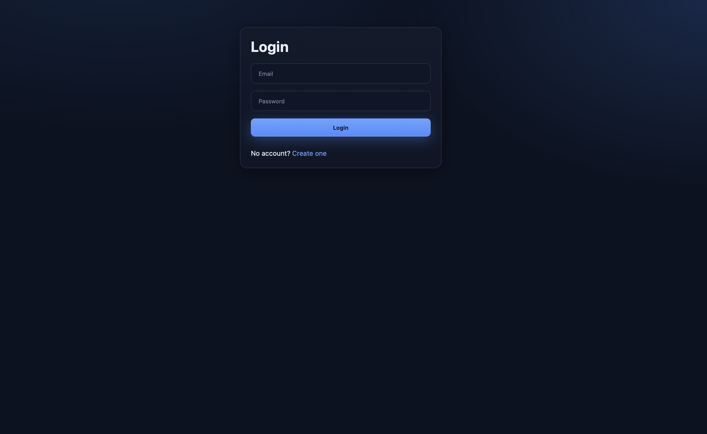
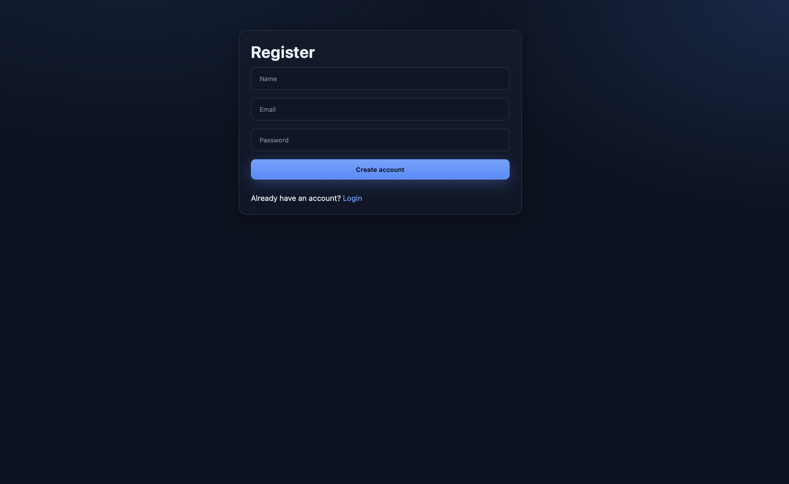
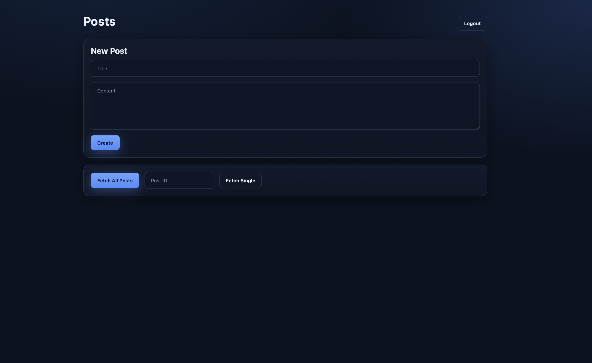
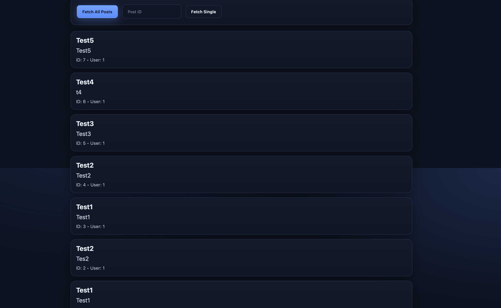
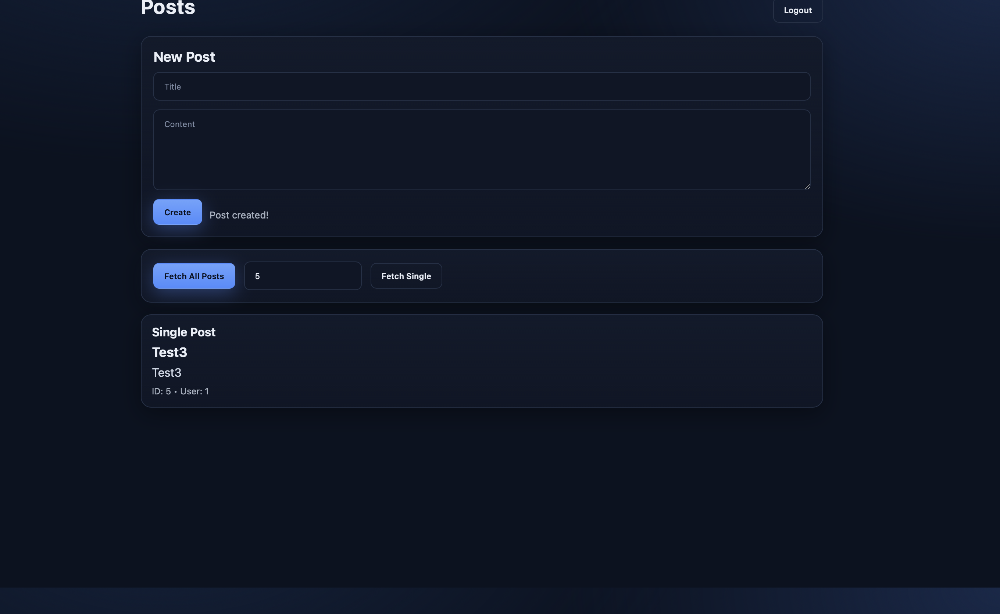
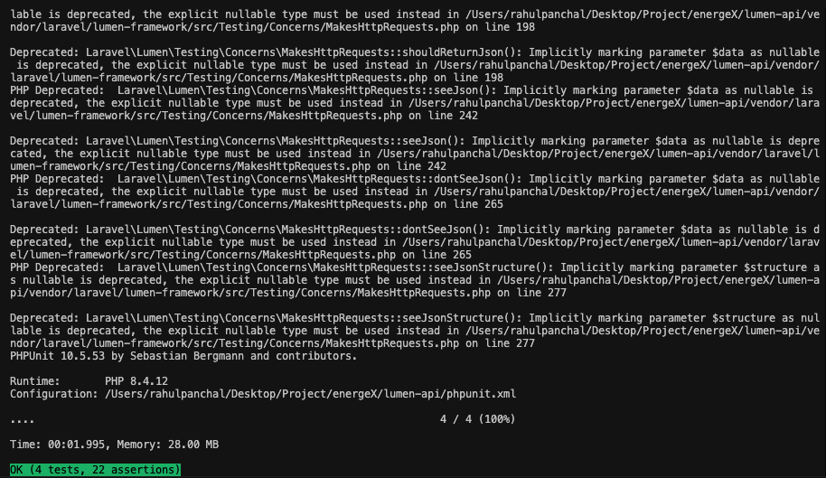
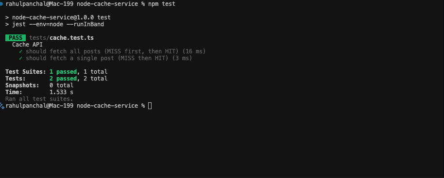
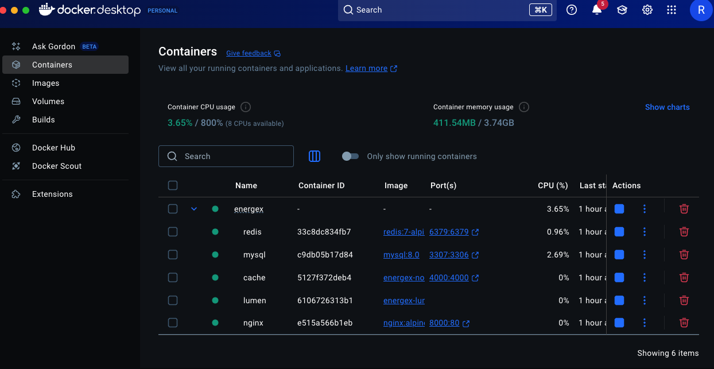
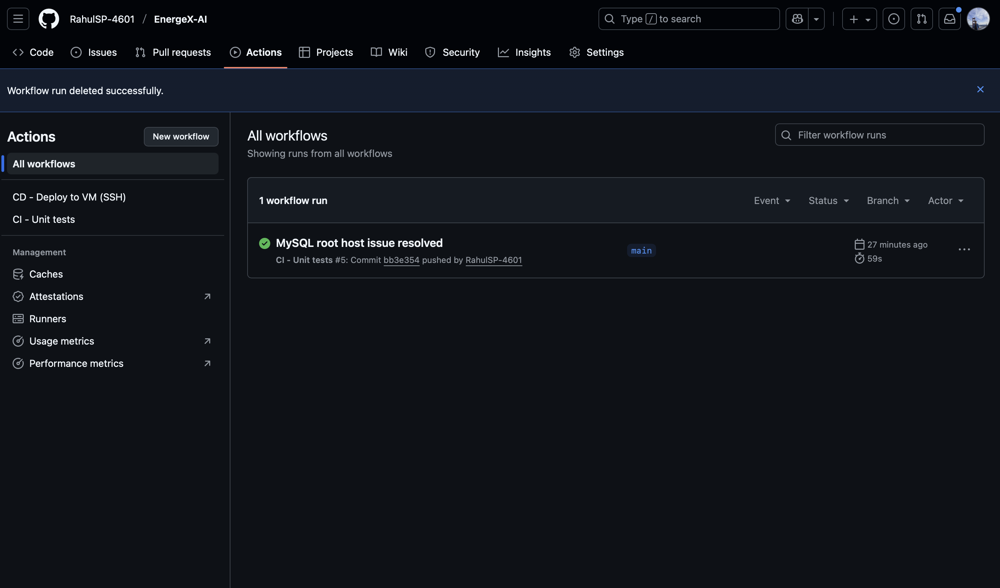
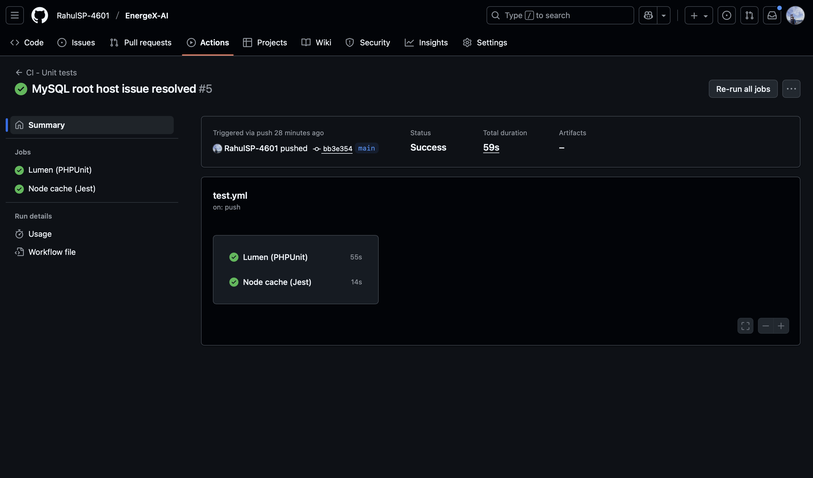

# EnergeX-AI – Full-Stack Developer Assessment

## Overview

EnergeX-AI is a microservice-based application built with **Lumen (PHP)**, **Node.js (TypeScript)**, **MySQL**, **Redis**, and a **React frontend**.  
It demonstrates secure user authentication (JWT), caching with Redis, containerization with Docker, unit testing, and a CI/CD pipeline with GitHub Actions.

---

## Features

- **Lumen (PHP) API**

  - `POST /api/register` → Register user
  - `POST /api/login` → Authenticate & get JWT
  - `GET /api/posts` → Fetch all posts (cached in Redis)
  - `POST /api/posts` → Create a post (requires JWT)
  - `GET /api/posts/{id}` → Fetch single post (cached)

- **Node.js Cache Layer (TypeScript)**

  - `GET /cache/posts` → Fetch cached posts
  - `GET /cache/posts/{id}` → Fetch single cached post

- **MySQL Database**

  - `users (id, name, email, password)`
  - `posts (id, title, content, user_id, created_at)`

- **Frontend (React)**

  - Register & Login forms
  - List all posts
  - Create a new post
  - List post by id

- **Redis Caching** for posts (improves performance).

- **JWT Authentication** for secure endpoints.

- **Testing**

  - PHPUnit (Lumen backend)
  - Jest + Supertest (Node cache service)

- **Dockerized Services** (Lumen, Node.js, MySQL, Redis, React).

- **CI/CD** with GitHub Actions: runs tests automatically on each push.

---

## Tech Stack

- **Backend (Auth & Posts):** Lumen (PHP)
- **Backend (Cache):** Node.js + TypeScript + Redis
- **Database:** MySQL 8.0
- **Frontend:** React + Vite
- **Testing:** PHPUnit, Jest, Supertest
- **Containerization:** Docker + Docker Compose
- **CI/CD:** GitHub Actions

---

## Setup Instructions

### Clone the repo

```bash
git clone https://github.com/RahulSP-4601/EnergeX-AI.git
cd EnergeX-AI
```

### Environment Variables

Create `.env` files for **Lumen** and **Node**.  
Example `.env` for Lumen:

```env
APP_KEY=base64:somekey
DB_CONNECTION=mysql
DB_HOST=db
DB_PORT=3306
DB_DATABASE=energeX
DB_USERNAME=root
DB_PASSWORD=root
JWT_SECRET=your_jwt_secret
CACHE_DRIVER=redis
REDIS_HOST=redis
REDIS_PORT=6379
```

Example `.env` for Node (node-cache-service/.env):

```env
REDIS_HOST=redis
REDIS_PORT=6379
MYSQL_HOST=db
MYSQL_PORT=3306
MYSQL_USER=root
MYSQL_PASSWORD=root
MYSQL_DATABASE=energeX
```

### Run with Docker Compose

```bash
docker-compose up --build
```

This starts:

- `lumen-api` (PHP backend)
- `node-cache-service` (TypeScript backend)
- `mysql` (DB)
- `redis` (Cache)
- `frontend` (React UI)

### Run Tests

#### Lumen (PHPUnit)

```bash
cd lumen-api
vendor/bin/phpunit
```

#### Node.js (Jest + Supertest)

```bash
cd node-cache-service
npm test
```

CI will also run these automatically on push.

---

## CI/CD

- GitHub Actions workflow (`.github/workflows/test.yml`) runs on every push.
- Runs:
  - PHPUnit tests (Lumen API)
  - Jest tests (Node.js cache service)
- Ensures no broken code is merged.

---

## Bonus Features

- JWT-based auth for posts.
- Redis caching with TTL.
- Docker orchestration for full stack.

---

## Output

- Login Page - POST /api/login
  

- Register Page - POST /api/register
  

- Create a new post - POST /api/posts
  

- Fetch All Post - GET /api/posts
  

- Fetch a single Post - GET /api/posts/{id}
  

- Lumen: PHPUnit for API routes and auth.
  

- Node.js: Jest (+ Supertest) for API responses.
  

- DevOps (Docker)
  

- CI/CD Pipeline
  
  
